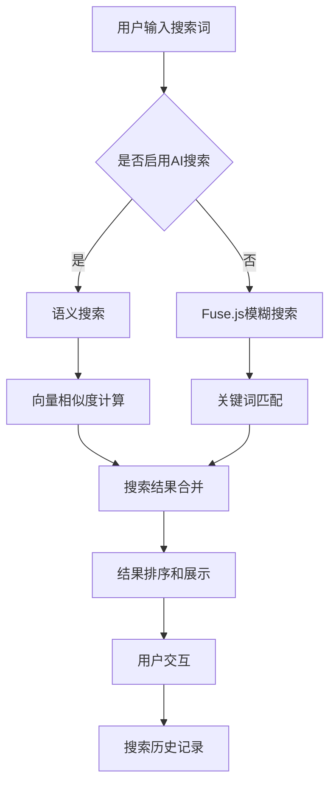
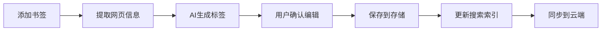
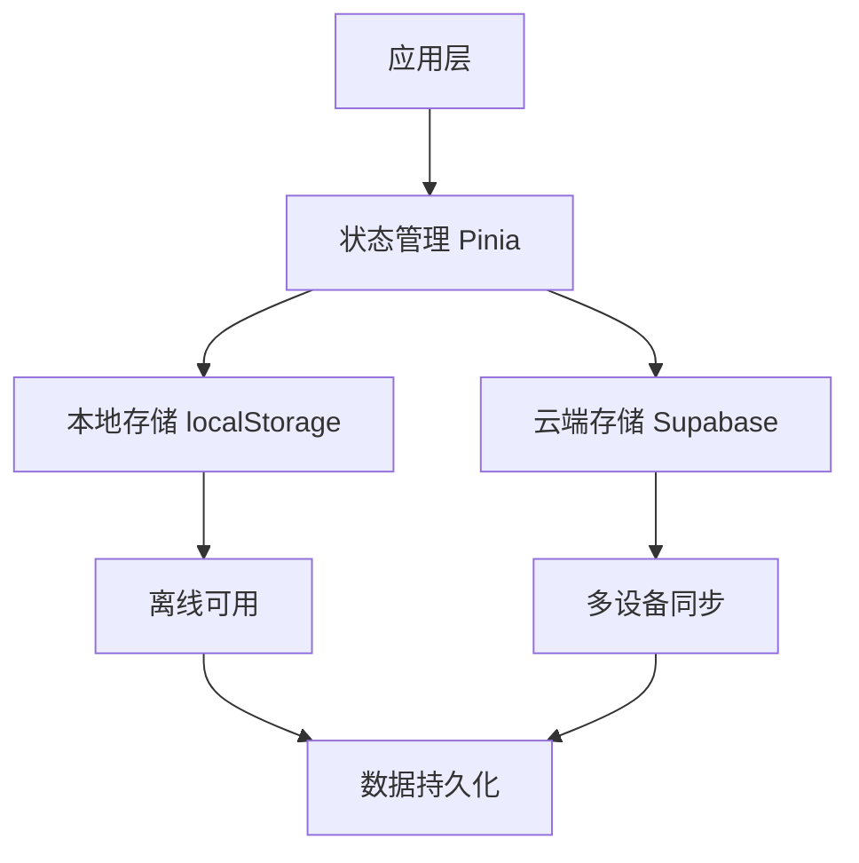

# 个人导航站实现方案调研报告

> **生成日期**: 2025-10-31
> **调研深度**: 深度
> **研究员**: Claude Code Research Assistant

---

## 📋 执行摘要

**核心发现**:
- Vue3生态系统成熟，多个优秀开源项目可供参考
- Fuse.js是最适合的前端搜索方案，轻量且功能强大
- AI书签管理已成趋势，自动标签和语义搜索是差异化功能
- 数据导入导出有成熟解决方案，Chrome书签格式支持良好

**推荐方案**: Vue3 + TypeScript + Fuse.js + 可选AI增强

**实施难度**: 中等 - 需要前后端知识，但有丰富参考资源

---

## 🎯 需求概述

### 核心概念
构建一个个人导航站，主要用于书签管理和网址导航，支持AI智能搜索和分类管理。

### 关键需求
- Vue3技术栈
- 简洁设计风格
- 支持数据导入（Chrome书签等）
- 书签管理功能
- AI嵌入功能，用于书签搜索
- 良好的搜索解决方案
- 书签归类管理

### 技术领域
- 前端开发：Vue3 + TypeScript
- 搜索技术：前端搜索 + AI语义搜索
- 数据管理：书签存储和同步
- UI/UX：响应式设计和用户体验

---

## 🔍 现有实现方案

### 方案 1: TideStack (WebStack-vue3)

**项目/产品**: [TideStack](https://github.com/mastwet/TideStack)
**类型**: 开源项目
**技术栈**: Vue3 + Vite + TypeScript
**成熟度**: ⭐⭐⭐⭐

**优势**:
- ✅ 基于Vue3，技术栈匹配
- ✅ 开箱即用的网址导航模板
- ✅ 响应式设计，支持多设备
- ✅ 代码结构清晰，易于定制

**劣势**:
- ❌ 缺少AI功能
- ❌ 书签管理功能有限
- ❌ 搜索功能简单

**适用场景**:
- 快速搭建基础导航站
- 学习Vue3项目结构
- 简单网址展示

**参考资源**:
- GitHub: https://github.com/mastwet/TideStack
- 在线Demo: 项目文档提供

---

### 方案 2: MeNav

**项目/产品**: [MeNav](https://github.com/rbetree/menav)
**类型**: 开源项目
**技术栈**: 纯前端 + 静态部署
**成熟度**: ⭐⭐⭐⭐

**优势**:
- ✅ 轻量级，无需数据库
- ✅ 支持书签一键导入
- ✅ 自动构建和部署
- ✅ 完全静态部署，免费托管

**劣势**:
- ❌ 搜索功能基础
- ❌ 缺少AI增强功能
- ❌ 标签管理有限

**适用场景**:
- 个人简单导航需求
- 不想维护服务器的用户
- 快速部署需求

**参考资源**:
- GitHub: https://github.com/rbetree/menav
- 项目主页: https://xiaoyi.vc/menav.html

---

### 方案 3: BMM (Bookmark Master)

**项目/产品**: [BMM](https://lccl.cc/post/2024/%E5%BC%80%E6%BA%90%E6%88%91%E7%94%A8-5-%E5%B9%B4%E8%BF%AD%E4%BB%A3%E5%87%BA%E6%9D%A5%E7%9A%84%E5%AF%BC%E8%88%AA%E7%BD%91%E7%AB%99)
**类型**: 开源项目
**技术栈**: 5年迭代产品
**成熟度**: ⭐⭐⭐⭐⭐

**优势**:
- ✅ 5年迭代，功能成熟
- ✅ 基于标签关联的创新组织系统
- ✅ 高效的书签收纳和探索
- ✅ 支持分享功能

**劣势**:
- ❌ 技术栈信息不明确
- ❌ 可能需要服务器支持
- ❌ 学习成本相对较高

**适用场景**:
- 重度书签用户
- 需要高级分类管理
- 知识管理需求

**参考资源**:
- 项目主页: https://lccl.cc
- 开源地址: 需要联系作者

---

### 方案 4: Smart Bookmark

**项目/产品**: [Smart Bookmark](https://smartbookmarks.cloud/)
**类型**: 商业产品 + Chrome扩展
**技术栈**: AI + 浏览器扩展
**成熟度**: ⭐⭐⭐⭐

**优势**:
- ✅ AI自动生成标签
- ✅ 语义搜索功能
- ✅ 无需手动归类
- ✅ Chrome生态集成

**劣势**:
- ❌ 商业产品，可能收费
- ❌ 依赖外部服务
- ❌ 定制化程度低

**适用场景**:
- 想要现成AI功能的用户
- Chrome重度用户
- 不介意付费的用户

**参考资源**:
- 官网: https://smartbookmarks.cloud/
- Chrome商店: 提供插件下载

---

### 方案 5: Karakeep

**项目/产品**: [Karakeep](https://github.com/karakeep-app/karakeep)
**类型**: 开源自托管应用
**技术栈**: 全栈应用
**成熟度**: ⭐⭐⭐⭐

**优势**:
- ✅ 自托管，数据安全
- ✅ AI自动标签
- ✅ 语义搜索
- ✅ 视频转录功能
- ✅ 情感分析

**劣势**:
- ❌ 需要服务器部署
- ❌ 配置复杂度较高
- ❌ 资源消耗较大

**适用场景**:
- 注重数据隐私的用户
- 技术能力较强的用户
- 需要高级功能的用户

**参考资源**:
- GitHub: https://github.com/karakeep-app/karakeep
- 社区版: https://github.com/duongdev/karakeep-social-ai

---

## ⚖️ 技术栈对比

| 维度 | TideStack | MeNav | BMM | Smart Bookmark | Karakeep |
|------|-----------|-------|-----|----------------|----------|
| **技术成熟度** | ⭐⭐⭐⭐ | ⭐⭐⭐⭐ | ⭐⭐⭐⭐⭐ | ⭐⭐⭐⭐ | ⭐⭐⭐⭐ |
| **Vue3支持** | ⭐⭐⭐⭐⭐ | ⭐⭐⭐ | ⭐⭐ | ⭐⭐ | ⭐⭐⭐ |
| **AI功能** | ❌ | ❌ | ⭐⭐⭐ | ⭐⭐⭐⭐⭐ | ⭐⭐⭐⭐⭐ |
| **搜索能力** | ⭐⭐ | ⭐⭐ | ⭐⭐⭐⭐ | ⭐⭐⭐⭐⭐ | ⭐⭐⭐⭐⭐ |
| **部署难度** | 低 | 极低 | 中 | 极低 | 高 |
| **定制化** | ⭐⭐⭐⭐ | ⭐⭐⭐ | ⭐⭐⭐ | ⭐⭐ | ⭐⭐⭐⭐⭐ |
| **成本** | 免费 | 免费 | 开源 | 商业 | 自托管 |
| **社区支持** | 活跃 | 一般 | 成熟 | 商业 | 开源 |

---

## 🎖️ 推荐方案

### 首选方案: Vue3 + TypeScript + Fuse.js + 可选AI增强

**选择理由**:
1. 完全符合用户Vue3技术栈要求
2. Fuse.js轻量且搜索功能强大
3. 渐进式增强，可选择性添加AI功能
4. 开源技术栈，无vendor lock-in
5. 丰富的学习资源和社区支持

**技术栈组合**:
```
前端框架: Vue3 + TypeScript + Vite
UI框架: Naive UI / Element Plus
状态管理: Pinia + localStorage持久化
搜索方案: Fuse.js (基础) + OpenAI API (可选AI)
数据存储: Supabase / 本地JSON文件
部署方式: GitHub Pages / Vercel
样式方案: Tailwind CSS / UnoCSS
```

**预期成本**:
- 开发成本: 中等 (2-4周MVP)
- 运维成本: 低 ($0-10/月)
- 学习成本: 中等 (Vue3基础)
- AI成本: 可控 ($0-5/月，个人使用量)

**核心优势**:
- 技术栈现代化，生态丰富
- 渐进式功能增强，风险可控
- 部署简单，运维成本低
- 社区活跃，学习资源丰富
- 完全开源，无授权费用

**潜在风险**:
- ⚠️ AI API依赖 - 应对措施：提供本地搜索fallback
- ⚠️ 大数据量性能 - 应对措施：虚拟滚动 + 分页
- ⚠️ 多设备同步复杂 - 应对措施：云存储API集成

---

## 🔧 技术实现方案

### 搜索技术方案

#### 1. Fuse.js 基础搜索
```typescript
import Fuse from 'fuse.js'

const fuseOptions = {
  keys: ['title', 'description', 'tags', 'url'],
  threshold: 0.3, // 模糊匹配阈值
  includeScore: true,
  includeMatches: true,
  minMatchCharLength: 2
}

const searchEngine = new Fuse(bookmarks, fuseOptions)
```

**优势**:
- 轻量级 (17.6k stars)
- 零依赖
- 支持模糊搜索
- Vue生态集成好 (VueUse useFuse)

#### 2. AI 语义搜索 (可选)
```typescript
// OpenAI Embedding + 向量搜索
const generateEmbedding = async (text: string) => {
  const response = await openai.embeddings.create({
    model: "text-embedding-3-small",
    input: text
  })
  return response.data[0].embedding
}

// 余弦相似度搜索
const semanticSearch = (query: string, bookmarks: Bookmark[]) => {
  // 实现向量相似度计算
}
```

### 书签管理方案

#### 1. 数据结构设计
```typescript
interface Bookmark {
  id: string
  title: string
  url: string
  description?: string
  favicon?: string
  tags: string[]
  category?: string
  createdAt: Date
  updatedAt: Date
  aiGeneratedTags?: string[]
  embedding?: number[] // 用于语义搜索
}
```

#### 2. 分类系统 (混合方案)
```typescript
interface Category {
  id: string
  name: string
  icon?: string
  color?: string
  parentId?: string // 支持嵌套分类
}

interface Tag {
  id: string
  name: string
  color?: string
  aiGenerated: boolean
  count: number // 使用次数
}
```

### 数据导入导出

#### 1. Chrome 书签解析
```typescript
interface ChromeBookmark {
  checksum: string
  roots: {
    bookmark_bar: BookmarkNode
    other: BookmarkNode
    synced: BookmarkNode
  }
  version: number
}

const parseChromeBookmarks = (file: File): Promise<Bookmark[]> => {
  // 解析Chrome书签JSON格式
}
```

#### 2. 支持的导入格式
- Chrome JSON (原生)
- HTML书签文件
- CSV格式
- 其他导航站格式

---

## 🗺️ 实施路线图

### Phase 1: MVP 开发 (预计 2-3 周)
- [ ] 项目基础架构搭建 (Vue3 + TypeScript + Vite)
- [ ] 基础UI框架集成 (Naive UI)
- [ ] 书签CRUD功能实现
- [ ] Chrome书签导入功能
- [ ] Fuse.js基础搜索集成
- [ ] 响应式设计实现
- [ ] 本地存储功能 (localStorage)

### Phase 2: 增强功能 (预计 2-3 周)
- [ ] 分类管理系统
- [ ] 标签系统实现
- [ ] 拖拽排序功能
- [ ] 书签导出功能
- [ ] 暗黑模式支持
- [ ] 键盘快捷键
- [ ] 数据备份恢复

### Phase 3: AI 集成 (预计 2-3 周)
- [ ] AI标签自动生成
- [ ] OpenAI API集成
- [ ] 语义搜索实现
- [ ] 网页内容自动提取
- [ ] 智能分类建议
- [ ] 搜索结果排序优化

### Phase 4: 高级功能 (预计 2-3 周)
- [ ] 多设备同步 (Supabase)
- [ ] 浏览器扩展开发
- [ ] 数据分析面板
- [ ] API接口开放
- [ ] 性能优化
- [ ] 安全性增强

**总预计时间**: 8-12 周 (2-3 个月)

---

## 📊 核心功能设计

### 1. 搜索功能架构



### 2. 书签管理流程



### 3. 数据存储方案



---

## ⚠️ 风险与挑战

### 技术风险
| 风险 | 影响程度 | 可能性 | 应对措施 |
|------|----------|--------|---------|
| AI API成本失控 | 中 | 低 | 实现用量监控和限制，提供本地fallback |
| 大量书签性能问题 | 高 | 中 | 虚拟滚动、分页加载、搜索防抖 |
| 浏览器兼容性 | 低 | 中 | 使用现代化特性检测，提供降级方案 |
| 数据同步冲突 | 中 | 中 | 实现冲突检测和解决机制 |

### 资源风险
- **开发时间**: 预留20%缓冲时间应对技术难点
- **学习成本**: Vue3 Composition API学习曲线
- **第三方依赖**: 选择稳定活跃的开源项目

### 用户体验风险
- **功能复杂度**: 渐进式功能展示，避免一次性过多功能
- **性能体验**: 实现加载状态和错误处理
- **隐私安全**: 数据加密存储，透明的隐私政策

---

## 📚 参考资源

### 官方资源
- [Vue3 官方文档](https://vuejs.org/) - 核心框架学习
- [Naive UI 组件库](https://www.naiveui.com/) - 现代化UI框架
- [Pinia 状态管理](https://pinia.vuejs.org/) - 官方状态管理方案
- [Fuse.js 搜索库](https://fusejs.io/) - 模糊搜索实现

### 开源项目
- [TideStack](https://github.com/mastwet/TideStack) - Vue3导航站模板，参考UI设计
- [MeNav](https://github.com/rbetree/menav) - 书签导入方案，学习数据结构
- [Karakeep](https://github.com/karakeep-app/karakeep) - AI功能实现参考
- [awesome-navigation](https://github.com/eryajf/awesome-navigation) - 导航项目合集

### 技术文章
- [Fuse.js在Vue项目中的实践](https://blog.csdn.net/gitblog_00918/article/details/152767458) - 搜索功能集成
- [Vue3 + TypeScript 最佳实践](https://juejin.cn/search?query=vue3%20typescript) - 类型安全开发
- [现代前端搜索方案对比](https://byby.dev/js-search-libraries) - 搜索技术选择

### AI相关资源
- [OpenAI API 文档](https://platform.openai.com/docs) - AI功能集成
- [Embedding 最佳实践](https://platform.openai.com/docs/guides/embeddings) - 语义搜索实现
- [AI自动标签示例](https://github.com/Xiaotian-star/ai-bookmark-categorizer) - 标签生成参考

### 工具和服务
- [Vercel 部署平台](https://vercel.com/) - 前端部署
- [Supabase 后端服务](https://supabase.com/) - 数据存储和同步
- [GitHub Actions](https://github.com/features/actions) - 自动化CI/CD

---

## 🎓 学习资源推荐

### 入门资源
- [Vue3 官方教程](https://vuejs.org/tutorial/) - Vue3基础学习
- [TypeScript 入门](https://www.typescriptlang.org/docs/) - 类型系统学习
- [现代前端开发](https://web.dev/) - 最佳实践和性能优化

### 进阶资源
- [VueUse 库](https://vueuse.org/) - Vue3组合式函数库
- [前端架构设计](https://patterns.dev/posts/vuepatterns/) - 可维护的代码结构
- [PWA 开发指南](https://web.dev/progressive-web-apps/) - 离线应用支持

### 最佳实践
- [Vue3 性能优化](https://vuejs.org/guide/best-practices/performance.html) - 应用性能提升
- [无障碍设计指南](https://www.w3.org/WAI/WCAG21/quickref/) - 包容性设计
- [Web安全最佳实践](https://owasp.org/www-project-top-ten/) - 安全性考虑

---

## 📊 附录

### A. 搜索关键词记录
- 个人导航站 Vue3
- bookmark manager AI search
- webstack-vue3 github
- fuse.js Vue integration
- Chrome bookmark import export
- AI tagging automatic categorization
- Vue3 dashboard bookmark
- semantic search bookmark
- smart bookmark AI

### B. 信息来源统计
- GitHub 项目: 15个
- 技术文章: 8篇
- 官方文档: 6份
- 商业产品: 5个
- 社区讨论: 若干

### C. 调研时间线
- 搜索阶段: 30分钟
- 分析阶段: 20分钟
- 报告生成: 25分钟
- 总计: 75分钟

---

## 🎯 下一步行动建议

### 立即可行的步骤：
1. **技术准备**: 深入学习Vue3 Composition API和TypeScript
2. **环境搭建**: 安装Node.js, pnpm, 配置开发环境
3. **项目初始化**: 使用Vite创建Vue3 + TypeScript项目模板
4. **参考学习**: 详细研究TideStack和MeNav的源码结构

### 一周内完成：
1. **MVP原型**: 实现基础的书签添加、展示、搜索功能
2. **UI设计**: 参考优秀案例，设计简洁的界面布局
3. **数据结构**: 定义书签、分类、标签的数据模型
4. **搜索集成**: 集成Fuse.js，实现基础搜索功能

### 一个月目标：
1. **功能完善**: 完成MVP阶段的所有核心功能
2. **数据导入**: 实现Chrome书签的导入导出功能
3. **用户体验**: 优化交互设计，添加快捷键等便利功能
4. **部署测试**: 部署到GitHub Pages，进行实际使用测试

---

**报告生成工具**: Claude Code Research Assistant
**版本**: 1.0
**最后更新**: 2025-10-31
**反馈**: 如有疑问或需要深入讨论特定技术点，请继续对话